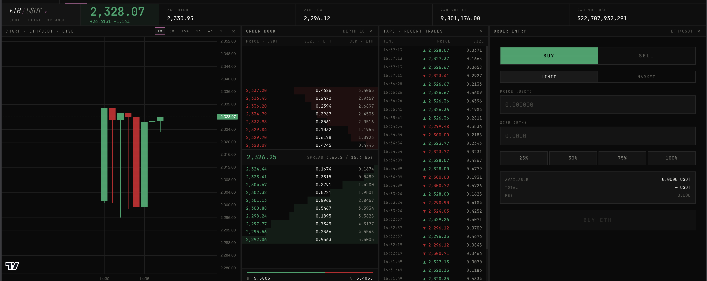
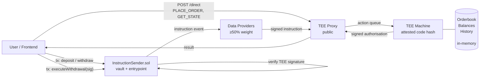
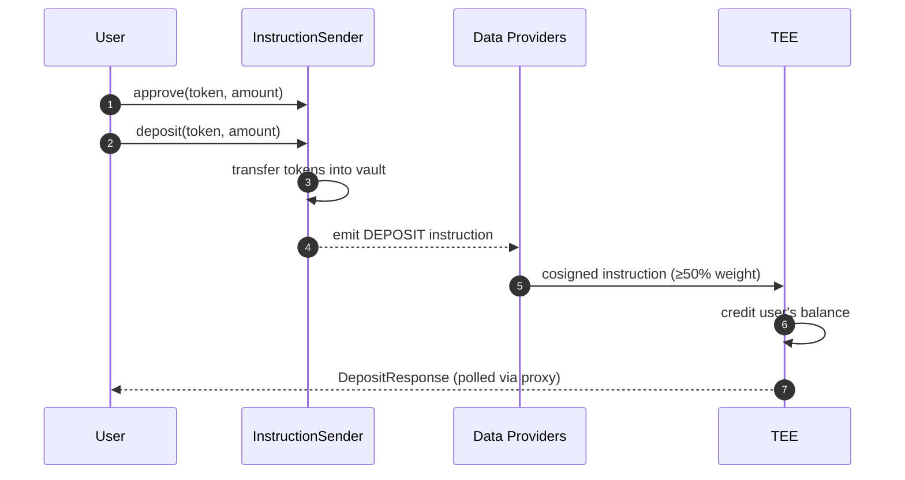
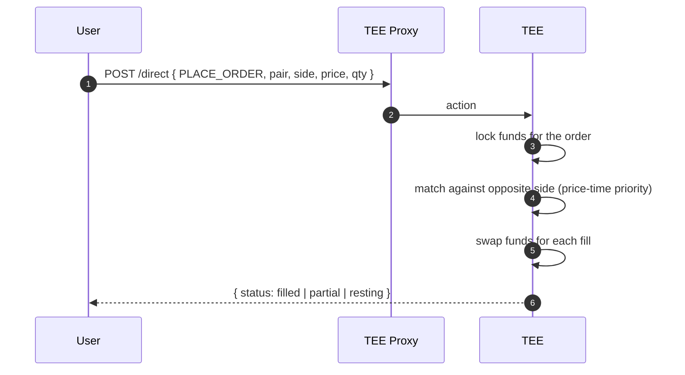
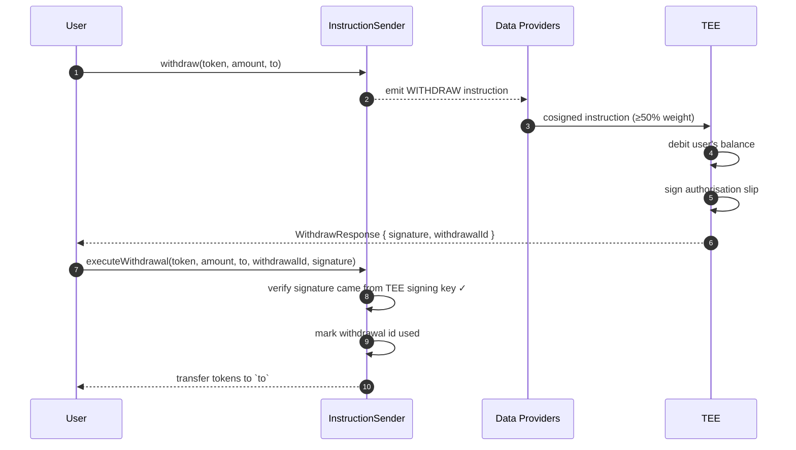

# Veil — Confidential OTC Settlement for FAssets

> A private order-matching and settlement layer for FXRP and other FAssets on Flare, built for the Flare Summer Signal hackathon. Matching runs inside a **Flare Confidential Compute (FCC)** TEE, open orders never touch the chain, and withdrawals are authorised by a TEE signature that the on-chain vault verifies before releasing funds. When configured, matches are checked against an **FTSO** price band; the current policy is deliberately fail-open if the oracle is absent or unavailable. The repo also includes zero-knowledge solvency proofs so a counterparty can prove sufficient collateral without revealing exact balances.

**This repository started as a fork of [`flare-foundation/fce-orderbook`](https://github.com/flare-foundation/fce-orderbook)**, Flare's own reference implementation of a confidential exchange on FCC — disclosed here and in `BUILD_NOTES.md` rather than hidden. The base gave us a working TEE matching engine, vault contract, and frontend on day one; the FAssets/FTSO price-band integration, and the ZK privacy layer are what's new. See `BUILD_NOTES.md` for the full reused-vs-new breakdown.



The underlying matching engine is deliberately non-trivial: price-time priority matching, real deposit and withdrawal custody, a working frontend, and a load-testing harness — inherited from the base and extended, not rebuilt from scratch.

---

## TL;DR

- **Private orderbook.** Open orders live only in TEE memory — never on-chain, never in a public mempool, never in the proxy's logs. No book-level MEV, no front-running, no sandwich attacks on resting orders.
- **Fair, deterministic matching.** Price-time priority, enforced by code that's pinned to a hash registered on-chain. Fills happen instantly inside the TEE — no per-fill gas, no on-chain settlement round trip.
- **Trust-minimised custody.** An on-chain vault holds tokens. Funds release only when the TEE produces a signed authorisation — and the TEE's signing key never leaves attested hardware and is backed up across data providers, so no single operator can drain the vault.
- **FCC-oriented architecture.** The design uses on-chain instructions for deposits/withdrawals, off-chain direct actions for trading/reads, and outbound TEE signatures for settlement. Earlier hackathon runs exercised this stack, but the current portfolio verification is deliberately offline and does not claim a fresh live FCC end-to-end run.

---

## Why Build This on FCC?

A classic on-chain orderbook is stuck between three bad options: keep orders on-chain and watch them get front-run, encrypt them with heavy cryptography that's expensive and fragile, or run matching off-chain with centralised custody and end up rebuilding a centralised exchange. FCC lets the book stay private *and* the custody stay trust-minimised at the same time.

Three concrete properties fall out of this repo:

1. **Orders are private while they rest.** The matching engine exists only inside the TEE. The proxy sees opaque action bodies; the chain sees nothing until a withdrawal is executed. A trader's intent doesn't leak between submission and match.
2. **Matching is deterministic and attested.** The exact code that runs the matching is pinned to a hash registered on-chain. Changing it requires a public, governable rollout — not a silent server swap. What you audit is what runs.
3. **Custody follows the signature, not the operator.** The vault releases funds on a signature from the TEE, not on a call from a privileged operator. You don't trust the team running the TEE — you trust the code hash and the data-provider consensus that admits it.


---

## Architecture



There are exactly three ways into a TEE and one way back out:

| Direction | Channel | Used for |
|---|---|---|
| In (on-chain) | `InstructionSender.sol` → data providers → proxy → TEE | `DEPOSIT`, `WITHDRAW` — actions that must be tied to a real on-chain transaction |
| In (off-chain) | Frontend → proxy → TEE (a "direct action") | `PLACE_ORDER`, `CANCEL_ORDER`, `GET_MY_STATE`, `GET_BOOK_STATE` — trading and reads |
| Out | TEE → proxy → user → chain | `executeWithdrawal(sig)` — user presents a TEE-signed authorisation to the vault |

The orderbook and pending-order state are in-memory TEE state. The per-user balance ledger is also in-memory by default, but operators can set `BALANCES_PATH` to enable an atomic JSON snapshot on disk for restart recovery; on load, stale held balances are released back to available because open orders themselves are not restored. `EXPORT_HISTORY` remains an explicit user-facing audit export rather than automatic durable order-history storage.

---

## How Users Interact

### 1. Deposit



The user approves the vault and calls `deposit(token, amount)`. ERC20 tokens move to the vault; the vault emits a `DEPOSIT` instruction. Data providers cosign it, the proxy forwards it to the TEE once the consensus threshold is met, and the TEE credits the user's available balance in memory. The frontend polls the proxy for the result.

The on-chain transfer *is* the authorisation — there is no separate signed deposit message. That's deliberate: only deposits that actually happened on-chain can credit a balance, because every instruction has to be cosigned above the consensus threshold before the TEE will act on it.

### 2. Trade

Placing and cancelling orders never hits the chain. The frontend sends a **direct action** straight to the proxy:



Inside the TEE, the order's funds are moved from available to locked, and the matching engine walks the opposite side of the book in price-time priority. Every fill is an atomic swap between maker and taker — no per-fill settlement, no signatures, no gas. If only part of an order fills, the rest stays resting in the TEE until it's matched or cancelled.

Reads use the same channel and are gasless: `GET_MY_STATE` returns the caller's balances, open orders, and personal trade history; `GET_BOOK_STATE` returns public depth and recent matches.

### 3. Withdraw — the novel part

Withdrawal is a **two-step, two-transaction** flow, and this is where the TEE-as-custodian model does its real work:



1. The user calls `withdraw(token, amount, to)` on the vault. This relays a `WITHDRAW` instruction to the TEE via the data providers.
2. Inside the TEE, the request is checked against the user's available balance, the balance is debited, and the TEE signs an authorisation slip carrying the token, amount, destination, and a unique withdrawal id.
3. The signed slip comes back through the proxy to the user.
4. The user (or anyone, on their behalf) submits `executeWithdrawal(...)` with the slip. The vault verifies the signature came from the registered TEE signing address, marks the withdrawal id used so it can't be replayed, and transfers the tokens.

The important consequence: **anyone** can broadcast `executeWithdrawal`. The signature is the authorisation, not the caller. That makes gas sponsorship, meta-transactions, and asynchronous settlement trivial to build on top — the vault doesn't need to know who the user is, only that the TEE said "pay `to`, once, for this amount".

The TEE's signing address is registered on the vault exactly once, at setup. Rotating it requires a new deployment (or a deliberate governance extension you add). A rogue operator can't silently swap signers.

For the exact signature preimage and on-chain verification logic, see [docs/flows/withdrawal.md](docs/flows/withdrawal.md).

---

## Security Model

**What the TEE guarantees**

- **Code attestation.** Every signed action is produced by a TEE binary whose code hash is registered on-chain. Changing matching, fees, or withdrawal logic requires registering and rolling out a new hash — a visible, governable event.
- **Consensus on inbound instructions.** On-chain `DEPOSIT` and `WITHDRAW` instructions are only executed if signed by data providers holding ≥50% of the current epoch's weight (up to 100 providers per 3.5-day rotation).
- **Replay protection.** Each withdrawal carries a unique id, generated on-chain. The vault rejects any id it has already executed.
- **Key resilience.** The TEE's signing key is split across data providers using Shamir secret sharing. Losing a single TEE doesn't leak the key, and the signing identity survives a TEE replacement.
- **Private execution state.** Orders and pending matches stay inside the TEE process. Balance persistence is optional: when `BALANCES_PATH` is configured, the balance manager writes atomic snapshots to the configured local path. Treat that path as sensitive operator state; it is not public market data.

**What the TEE does not guarantee**

- **Ordering.** FCC is explicitly "fire and forget": two direct actions submitted in quick succession may arrive at the TEE in either order. The matching engine is designed around this — it is single-writer per pair — but any logic you add on top must be safe without ordering assumptions.
- **Liveness.** The public proxy can delay or drop actions. Withdrawals remain recoverable via the consensus-signed on-chain instruction path, but a sustained proxy outage halts new trading.
- **Hardware trust.** If a TEE vendor is compromised or the attestation chain is broken, the code-hash guarantee collapses. This is mitigated operationally — running across multiple TEE vendors, rotating attestation — not by FCC itself.

---

## Prerequisites

Requires Go ≥1.25.1 (per `go.mod`). The dependency graph itself is
self-contained: `github.com/flare-foundation/tee-node` is pinned to a
published version rather than a local sibling checkout.

For the reproducible portfolio path, run:

```bash
./scripts/offline-demo.sh
```

That command exercises the matching engine, solvency verification and
extension state plus race checks without FCC, chain RPC, Docker, the proxy,
or a live FTSO endpoint.

A full `go build ./...` is **not currently a clean-clone gate**: the
tracked `cmd/veil` deployment CLI imports `veil/internal/deploy`, but
that deployment-engine source package is absent from this repository
snapshot. The older unanchored `deploy/` ignore rule could also hide
`internal/deploy/`; it is now anchored to `/deploy/` so future source
cannot be silently omitted. Restoring the original deployment package is
parked separately from the verified offline case study.

---

## Try It Locally

The reproducible no-infrastructure demo is:

```bash
./scripts/offline-demo.sh
```

It requires only the Go toolchain and does not submit transactions or depend
on FCC, a proxy, Docker, chain RPC, or a live FTSO endpoint.

The repository also contains Docker/FCC deployment documentation and the
tracked `cmd/veil` CLI entry point. Those describe the larger hackathon
deployment workflow, but the corresponding `internal/deploy` source package
is missing from the current repository snapshot. Treat `veil deploy all` /
`veil deploy resume` as **historical/parked workflow documentation**, not
as a clean-clone command that this revision claims to reproduce.

The frontend source remains under `frontend/`; a fresh frontend install and
live proxy round-trip are outside this bounded offline verification pass.

---

## Testing

- **Reproducible offline gate** — `./scripts/offline-demo.sh`: focused
  orderbook, solvency and extension tests plus race detection for matching and
  extension state.
- **Focused extension suite** — freshly observed as 27 tests passed, 0 skipped,
  0 failed on Go 1.25.1.
- **Full module build** — currently blocked by the missing
  `veil/internal/deploy` package imported by `cmd/veil`; do not report
  `go test ./...` as green until that source is restored.
- **Live FCC / stress / soak** — infrastructure-dependent and not freshly
  replayed in this portfolio pass. See [docs/testing.md](docs/testing.md) and
  [docs/stress-test.md](docs/stress-test.md) for the historical workflow and
  prerequisites.

For the exact safe claims and parked work, see
[`docs/portfolio-checklist.md`](docs/portfolio-checklist.md).

---

## Further Reading

- [docs/architecture.md](docs/architecture.md) — full system map: contracts, Go packages, state model, signing architecture
- [docs/flows/deposit.md](docs/flows/deposit.md), [orders.md](docs/flows/orders.md), [withdrawal.md](docs/flows/withdrawal.md) — per-flow deep dives with ABI layouts and code refs
- [docs/extension-guide.md](docs/extension-guide.md) — extension internals, if you want to fork this as a template for your own product
- [docs/instruction-sender.md](docs/instruction-sender.md) — on-chain contract patterns
- [docs/types-server.md](docs/types-server.md) — how the proxy decodes extension payloads
- [docs/testing.md](docs/testing.md) — test runner, unit + integration setup
- [docs/stress-test.md](docs/stress-test.md) — load generator and soak profiles

---

## Built On

Flare Confidential Compute — see the [FCC overview](https://dev.flare.network/fcc/overview) for the underlying primitives (extensions, signing policies, data providers, attestation, Protocol Managed Wallets).
